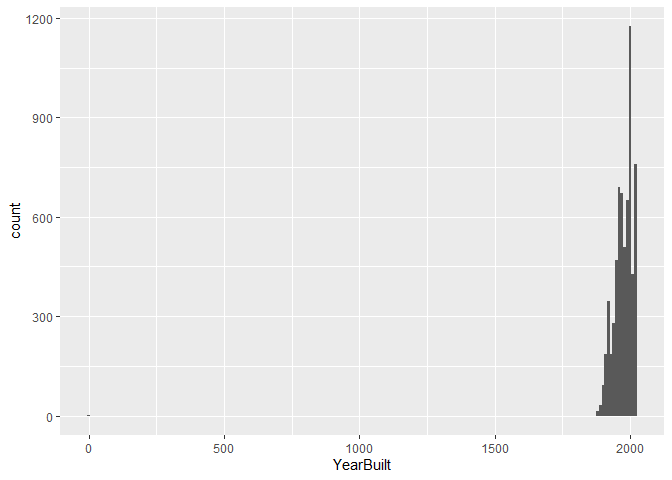
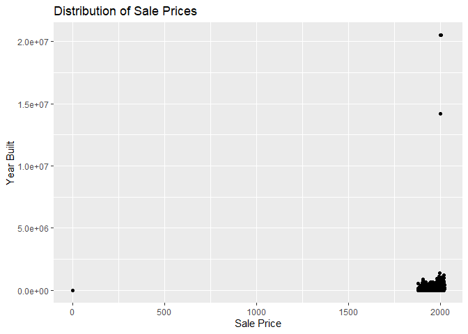
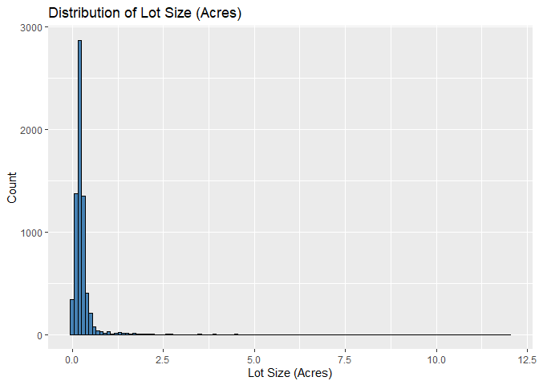
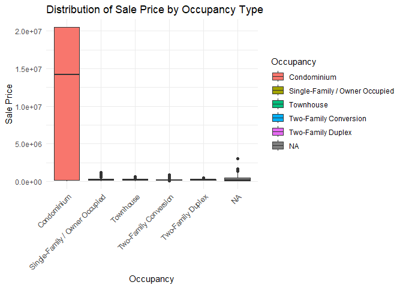
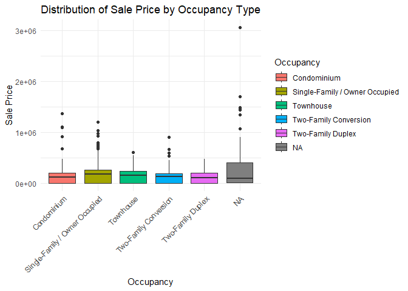

<!-- README.md is generated from README.Rmd. Please edit the README.Rmd file -->

# Lab report \#1

Follow the instructions posted at
<https://ds202-at-isu.github.io/labs.html> for the lab assignment. The
work is meant to be finished during the lab time, but you have time
until Monday evening to polish things.

Include your answers in this document (Rmd file). Make sure that it
knits properly (into the md file). Upload both the Rmd and the md file
to your repository.

All submissions to the github repo will be automatically uploaded for
grading once the due date is passed. Submit a link to your repository on
Canvas (only one submission per team) to signal to the instructors that
you are done with your submission.

``` r
library(classdata)
 data(ames)
 
 summary(ames)
```

    ##   Parcel ID           Address                        Style     
    ##  Length:6935        Length:6935        1 Story Frame    :3732  
    ##  Class :character   Class :character   2 Story Frame    :1456  
    ##  Mode  :character   Mode  :character   1 1/2 Story Frame: 711  
    ##                                        Split Level Frame: 215  
    ##                                        Split Foyer Frame: 156  
    ##                                        (Other)          : 218  
    ##                                        NA's             : 447  
    ##                           Occupancy      Sale Date            Sale Price      
    ##  Condominium                   : 711   Min.   :2017-07-03   Min.   :       0  
    ##  Single-Family / Owner Occupied:4711   1st Qu.:2019-03-27   1st Qu.:       0  
    ##  Townhouse                     : 745   Median :2020-09-22   Median :  170900  
    ##  Two-Family Conversion         : 139   Mean   :2020-06-14   Mean   : 1017479  
    ##  Two-Family Duplex             : 182   3rd Qu.:2021-10-14   3rd Qu.:  280000  
    ##  NA's                          : 447   Max.   :2022-08-31   Max.   :20500000  
    ##                                                                               
    ##   Multi Sale          YearBuilt        Acres         TotalLivingArea (sf)
    ##  Length:6935        Min.   :   0   Min.   : 0.0000   Min.   :   0        
    ##  Class :character   1st Qu.:1956   1st Qu.: 0.1502   1st Qu.:1095        
    ##  Mode  :character   Median :1978   Median : 0.2200   Median :1460        
    ##                     Mean   :1976   Mean   : 0.2631   Mean   :1507        
    ##                     3rd Qu.:2002   3rd Qu.: 0.2770   3rd Qu.:1792        
    ##                     Max.   :2022   Max.   :12.0120   Max.   :6007        
    ##                     NA's   :447    NA's   :89        NA's   :447         
    ##     Bedrooms      FinishedBsmtArea (sf)  LotArea(sf)          AC           
    ##  Min.   : 0.000   Min.   :  10.0        Min.   :     0   Length:6935       
    ##  1st Qu.: 3.000   1st Qu.: 474.0        1st Qu.:  6553   Class :character  
    ##  Median : 3.000   Median : 727.0        Median :  9575   Mode  :character  
    ##  Mean   : 3.299   Mean   : 776.7        Mean   : 11466                     
    ##  3rd Qu.: 4.000   3rd Qu.:1011.0        3rd Qu.: 12088                     
    ##  Max.   :10.000   Max.   :6496.0        Max.   :523228                     
    ##  NA's   :447      NA's   :2682          NA's   :89                         
    ##   FirePlace                            Neighborhood 
    ##  Length:6935        (27) Res: N Ames         : 854  
    ##  Class :character   (37) Res: College Creek  : 652  
    ##  Mode  :character   (57) Res: Investor Owned : 474  
    ##                     (29) Res: Old Town       : 469  
    ##                     (34) Res: Edwards        : 444  
    ##                     (19) Res: North Ridge Hei: 420  
    ##                     (Other)                  :3622

``` r
 head(ames)
```

    ##    Parcel ID                       Address             Style
    ## 1 0903202160      1024 RIDGEWOOD AVE, AMES 1 1/2 Story Frame
    ## 2 0907428215 4503 TWAIN CIR UNIT 105, AMES     1 Story Frame
    ## 3 0909428070        2030 MCCARTHY RD, AMES     1 Story Frame
    ## 4 0923203160         3404 EMERALD DR, AMES     1 Story Frame
    ## 5 0520440010       4507 EVEREST  AVE, AMES              <NA>
    ## 6 0907275030       4512 HEMINGWAY DR, AMES     2 Story Frame
    ##                        Occupancy  Sale Date Sale Price Multi Sale YearBuilt
    ## 1 Single-Family / Owner Occupied 2022-08-12     181900       <NA>      1940
    ## 2                    Condominium 2022-08-04     127100       <NA>      2006
    ## 3 Single-Family / Owner Occupied 2022-08-15          0       <NA>      1951
    ## 4                      Townhouse 2022-08-09     245000       <NA>      1997
    ## 5                           <NA> 2022-08-03     449664       <NA>        NA
    ## 6 Single-Family / Owner Occupied 2022-08-16     368000       <NA>      1996
    ##   Acres TotalLivingArea (sf) Bedrooms FinishedBsmtArea (sf) LotArea(sf)  AC
    ## 1 0.109                 1030        2                    NA        4740 Yes
    ## 2 0.027                  771        1                    NA        1181 Yes
    ## 3 0.321                 1456        3                  1261       14000 Yes
    ## 4 0.103                 1289        4                   890        4500 Yes
    ## 5 0.287                   NA       NA                    NA       12493  No
    ## 6 0.494                 2223        4                    NA       21533 Yes
    ##   FirePlace              Neighborhood
    ## 1       Yes       (28) Res: Brookside
    ## 2        No    (55) Res: Dakota Ridge
    ## 3        No        (32) Res: Crawford
    ## 4        No        (31) Res: Mitchell
    ## 5        No (19) Res: North Ridge Hei
    ## 6       Yes   (37) Res: College Creek

``` r
 unique(ames$`Multi Sale`)
```

    ## [1] NA  "Y"

## Step 1.

What variables: Parcel ID, Address, Style, Occupancy, Sale Date, Sale
Price, Multi Sale, YearBuilt, Acres, TotalLivingArea (sf), Bedrooms,
FinshedBsmtArea (sf), LotArea(sf), AC, FirePlace, Neighborhood. The
variables are of type character, numerical, and date. What do these
variables mean: Sale date is the date of the sale of the property,
expected data range 2017-2022. Sale price is the amount of money in
American dollars that the property was sold for, expected range 0, 20
million. Multi Sale shows if the sale consisted of more than one
property, Y showing that it was, NA otherwise, expected possible values,
NA and Y. YearBuilt is the year that the house or building was built,
expected range, 0-2022.

<<<<<<< HEAD
======= \## Step 2. The main variable for this report is `Sale Price`,
we will be focusing on exploring relations between it and other
variables in the dataset.

Vaishnavi
=======
Parcel ID: A unique ID used to identify a property to authorities, this
could be any range of unique values. Address: This represents the
address of the property. This is expected to not be empty, but it could
be any address. Style: This marks the style of the house / property, the
range for this dataset is: 1 Story Frame, 2 Story Frame, 1 1/2 Story
Frame, Split Level Frame, Split Foyer Frame, (Other), or NA. Occupancy:
This marks what type of occupancy it is, the ranges we expect for this
dataset are: Condominium, Single-Family / Owner Occupied, Townhouse,
Two-Family Conversion, Two-Family Duplex, or NA. Acres: Represents the
size of the lot on which the residence is located. Values range from 0
to 12. TotalLivingArea: Indicates the total interior living space of the
residence. Values range from 0 to 6,000 square feet. Bedrooms: The
number of bedrooms in the residence. This ranges from 0 to 10, with some
missing values. FinishedBasementArea: Refers to the finished area of the
basement in square feet. Values range from 10 to 6,494 square feet, with
some missing values. LotArea(sf): It is a Square feet area of a house
for a particular house sale home.it is measured by Square feet and the
range will be from 1000 sf. AC: It says whether a house has AC or not.
There will be no range because it is yes or no thing. Fireplace: It will
say that whether they has a fireplace or not in a house. I think their
will no range because it is yes or no thing. Neibhorhood: It says in
which area is it located. Their will not range for that too.

## Step 2.

As a team, we found the following. The main variable for this report is
`Sale Price`, we will be focusing on exploring relations between it and
other variables in the dataset.

## Step 3

As a team, we found the following. Range of Sales Price:

``` r
min(ames$`Sale Price`)
```

    ## [1] 0

``` r
max(ames$`Sale Price`)
```

    ## [1] 20500000

``` r
range(ames$`Sale Price`)
```

    ## [1]        0 20500000

``` r
diff(range(ames$`Sale Price`))
```

    ## [1] 20500000

The range of home sale prices in the Ames dataset spans from the 0 sale
price to the 20500000, showing the spread of values across the housing
market.

``` r
library(tidyverse)
```

    ## ── Attaching core tidyverse packages ──────────────────────── tidyverse 2.0.0 ──
    ## ✔ dplyr     1.1.4     ✔ readr     2.1.5
    ## ✔ forcats   1.0.1     ✔ stringr   1.5.2
    ## ✔ ggplot2   4.0.0     ✔ tibble    3.3.0
    ## ✔ lubridate 1.9.4     ✔ tidyr     1.3.1
    ## ✔ purrr     1.1.0     
    ## ── Conflicts ────────────────────────────────────────── tidyverse_conflicts() ──
    ## ✖ dplyr::filter() masks stats::filter()
    ## ✖ dplyr::lag()    masks stats::lag()
    ## ℹ Use the conflicted package (<http://conflicted.r-lib.org/>) to force all conflicts to become errors

``` r
ggplot(ames, aes(x = `Sale Price`)) +
  geom_bar(fill = "steelblue", color = "Black") +
  labs(
    title = "Distribution of Sale Prices",
    x = "Sale Price",
    y = "Count"
  )
```

<!-- -->

The histogram of Sale Price shows a right-skewed distribution where most
homes sell at lower to mid-range prices, but a few extremely high-priced
outliers in the millions stretch the scale and make the main pattern
harder to see.

## Step 4

Norah’s work: One variable that could be related to the main variable,
Sale Price, is Year Built. The range of this variable is 0-2022. It’s
distribution is left skewed, roughly centered around the late 1900s,
approximately the 1990s.

``` r
summary(ames$YearBuilt)
```

    ##    Min. 1st Qu.  Median    Mean 3rd Qu.    Max.    NA's 
    ##       0    1956    1978    1976    2002    2022     447

``` r
ggplot(ames, aes(x=YearBuilt)) + geom_histogram(binwidth = 10)
```

    ## Warning: Removed 447 rows containing non-finite outside the scale range
    ## (`stat_bin()`).

<!-- -->

``` r
ggplot(ames, aes(y = `Sale Price`, x = `YearBuilt`)) +
  geom_point(fill = "steelblue", color = "Black") +
  labs(
    title = "Distribution of Sale Prices",
    x = "Sale Price",
    y = "Year Built"
  )
```

    ## Warning: Removed 447 rows containing missing values or values outside the scale range
    ## (`geom_point()`).

<!-- -->

``` r
#This is clearly too compressed, we will remove the year values of 0.
# and also sale prices over 1 million since there are only a few and we need to see the overall pattern.

ames %>% filter(YearBuilt !=0, `Sale Price` <= 1000000) %>%
  ggplot(aes(y = `Sale Price`, x = YearBuilt)) +
  geom_point(fill = "steelblue", color = "Black") +
  labs(
    title = "Distribution of Sale Prices",
    x = "Sale Price",
    y = "Year Built"
  )
```

<!-- --> This plot
shows a weak positive correlation between year built and sale price.
This variable does not seem to explain any of the oddities from part 3.
The low value outlier appears to be a mistake, with both values being 0
(the house was definitely not built in year 0.) The high value outliers
are only high in the year built value, so these are not the same as the
high outliers seen in the histogram of the distribution of sale prices.
The high values in the sale price histogram are likely the values
referred to in the warning where it says that some values were excluded
for being outside of the scaling range.

End of Norah’s work.

Prudvik’s work:

one variable that we will compare main variable is acers. area of the
land with its sales price.

``` r
range(ames$Acres, na.rm = TRUE)
```

    ## [1]  0.000 12.012

The range of lot size in acres spans from 0.000 to 12.012, showing that
most properties are very small while a few extend to much larger
acreages.

``` r
library(tidyverse)

ggplot(ames, aes(x = Acres)) +
  geom_histogram(binwidth = 0.1, fill = "steelblue", color = "black") +
  labs(title = "Distribution of Lot Size (Acres)",
       x = "Lot Size (Acres)", y = "Count")
```

    ## Warning: Removed 89 rows containing non-finite outside the scale range
    ## (`stat_bin()`).

<!-- --> The
distribution of lot size is highly right-skewed, with the majority of
homes built on very small lots under 1 acre. A few properties extend up
to 12 acres, but these are rare outliers that stretch the scale and make
the main cluster of smaller lots appear compressed. This suggests that
while most homes in the dataset are located on relatively compact
residential lots, a handful of unusually large properties stand out as
exceptions.

Since extreme outliers in both Sale Price and lot size (Acres) were
distorting the analysis, we applied filters to remove homes priced above
\$1,000,000 and properties larger than 7 acres. This allowed us to focus
on the majority of typical houses in the dataset and better observe the
true relationship between Sale Price and lot size without the influence
of unusual extreme cases

``` r
library(ggplot2)

# Filter sales price under 1 million
filtered_data <- subset(ames, `Sale Price` <= 1000000 & `Acres`< 7)

# Scatterplot of Sale Price vs Acres
ggplot(filtered_data, aes(x = Acres, y = `Sale Price`)) +
  geom_point(alpha = 0.6, color = "steelblue") +
  labs(
    title = "Scatterplot of Sale Price vs. Acres Filtered",
    x = "Acres",
    y = "Sale Price"
  )
```

<!-- --> The
scatterplot shows that most houses are on smaller lots under 1 acre, and
their sale prices vary widely. Houses on larger lots (2–6 acres) don’t
always have higher prices, which is a bit unusual. This suggests that
lot size alone doesn’t strongly determine the sale price, and other
factors like location or house features play a big role.

#### Harrison’s work

I am going to explore the `Occupancy` variable. This is a categorical
variable, as there are only a certain number of fixed discrete variables
it can be.

``` r
library(ggplot2)
library(dplyr)
clean <- ames %>%
  filter(`Sale Price` > 0)
ggplot(clean, aes(x = Occupancy, y = `Sale Price`, fill = Occupancy)) +
  geom_boxplot() + 
  labs(title = "Distribution of Sale Price by Occupancy Type",
       x = "Occupancy",
       y = "Sale Price") +
  theme_minimal() +
  theme(axis.text.x = element_text(angle = 45, hjust = 1))
```

<!-- -->

``` r
clean <- ames %>%
  filter(`Sale Price` < 1e7)
ggplot(clean, aes(x = Occupancy, y = `Sale Price`, fill = Occupancy)) +
  geom_boxplot() + 
  labs(title = "Distribution of Sale Price by Occupancy Type",
       x = "Occupancy",
       y = "Sale Price") +
  theme_minimal() +
  theme(axis.text.x = element_text(angle = 45, hjust = 1))
```

<!-- -->

``` r
range(ames$`Sale Price`, na.rm = TRUE)
```

    ## [1]        0 20500000

We see here that there are a few oddites:

1.  There are a lot of `Sale Price` that are equal to 0.

2.  There is an outlier at 20.5 million dollars on a condo.

Even in the filtered out plot, there is still pretty major outliers in
the NA category. These are most likely to do with plots of land to be
developed, as some of these would be much more expensive than regular
housing.

We do still see a good amount of outliers in Condos and Single-Family as
well.

``` r
library(dplyr)

outlier <- ames %>%
  filter(`Sale Price` == max(`Sale Price`, na.rm = TRUE)) %>%
  select(`Parcel ID`, Address, Occupancy, `Sale Price`)

outlier
```

    ## # A tibble: 188 × 4
    ##    `Parcel ID` Address                            Occupancy   `Sale Price`
    ##    <chr>       <chr>                              <fct>              <dbl>
    ##  1 0914276210  416 BILLY SUNDAY RD UNIT 101, AMES Condominium     20500000
    ##  2 0914276215  416 BILLY SUNDAY RD UNIT 102, AMES Condominium     20500000
    ##  3 0914276220  416 BILLY SUNDAY RD UNIT 103, AMES Condominium     20500000
    ##  4 0914276225  416 BILLY SUNDAY RD UNIT 104, AMES Condominium     20500000
    ##  5 0914276230  416 BILLY SUNDAY RD UNIT 105, AMES Condominium     20500000
    ##  6 0914276235  416 BILLY SUNDAY RD UNIT 106, AMES Condominium     20500000
    ##  7 0914276240  416 BILLY SUNDAY RD UNIT 107, AMES Condominium     20500000
    ##  8 0914276245  416 BILLY SUNDAY RD UNIT 108, AMES Condominium     20500000
    ##  9 0914276250  416 BILLY SUNDAY RD UNIT 109, AMES Condominium     20500000
    ## 10 0914276255  416 BILLY SUNDAY RD UNIT 110, AMES Condominium     20500000
    ## # ℹ 178 more rows

Here we see that the 416 BILLY SUNDAY RD Condos are ALL listed for the
MAX price, this is probably some sort of error, and should most likely
be filtered out.

Two-Family Duplex and Townhouse seem to be the only ones without extreme
outliers.

We can conclude that properties like condos and single-family are highly
variable in price.
>>>>>>> 83f392391520f66695a36792c904f670cb272251
